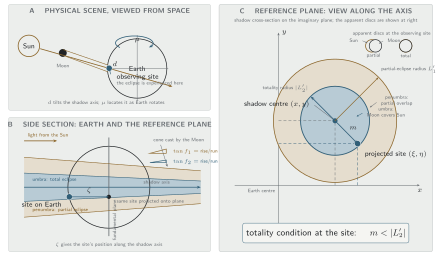
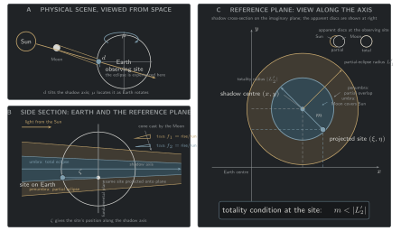
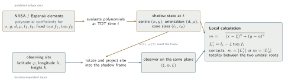
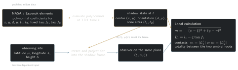
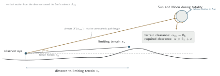
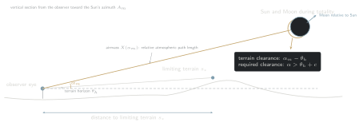
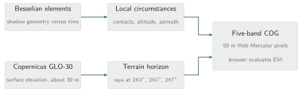
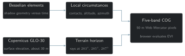

This model was designed and iterated via manual gathering of resources and thinking electric
meat, so-called human brain, currently typing this message
([JAMF](https://ja-mf.github.io)), but the implementation was done almost entirely by LLM.
The main motivation is, basically, that modeling relatively simple geometry problems is fun,
and that it's worth proving that, as of this date, public-domain geographic data is enough to
run these calculations and render them informatively in a browser; closer to the original
spirit of the internet than most of what runs on it now. Therefore, in line with Barthes's
*La mort de l'auteur*, interpretations and psychological readings of the code belong to the
infinite multiplicity of eyes beholding this publicly. Thus, I prefer to chew glass than to
care about licensing; feel free to do whatever you want with it. Nevertheless, happy to
discuss the science and implementation, and to do Freudian therapy on a mixture of LLMs that
spitted this code over the agentic sessions.

Code: [github.com/ja-mf/eclipse-visibility-spain-2026](https://github.com/ja-mf/eclipse-visibility-spain-2026).

This model estimates whether terrain blocks the total phase of the 12 August 2026 solar
eclipse, and ranks locations where totality remains visible. The current area of interest
covers parts of eastern Spain. Within it, the Sun is only about 3.2--6.7 degrees above the
apparent horizon at maximum eclipse and lies near azimuth 285 degrees. At those elevations,
local terrain is comparable in angular size to the Sun's clearance above the horizon.

The browser does not receive a precomputed score. For each 50 m output pixel it receives the
terrain-horizon elevation angle toward the Sun, apparent solar altitude at maximum eclipse,
decrease in solar altitude from C2 to C3, duration of totality, and distance to the terrain
sample that defines the horizon. It combines the first four fields into the Eclipse
Visibility Index (EVI) using the current UI parameters. The result is a comparative score,
not a probability of seeing the eclipse. It does not include cloud, access, legal
restrictions, or small obstacles absent from the elevation model.

## Model definition

The model is defined in four stages: the lunar-shadow geometry determines where and when
totality occurs; the terrain model determines the apparent skyline in the solar direction;
the contact altitudes determine what fraction of totality clears that skyline; and EVI
combines that geometric fraction with duration, atmospheric extinction, and clearance
margin. This part defines those quantities independently of their numerical implementation.

### 1. Eclipse geometry

#### Besselian elements

The Moon intercepts sunlight and produces two nested shadow regions: the penumbra, where it
covers only part of the solar disc, and the narrower umbra, where it covers the disc
completely. An observer experiences totality only while the observing site lies inside that
moving umbra. The three views below show how that physical statement becomes a planar
distance calculation.

```{=html}
<figure class="model-diagram">


<figcaption><strong>A.</strong> The physical event is the Moon intercepting sunlight and its
shadow reaching an observing site on Earth. <strong>B.</strong> Seen from the side, the Moon
casts a broad penumbra and a narrower umbra; their boundary slopes are tan
f<sub>1</sub> and tan f<sub>2</sub>. The site is projected onto a plane through Earth's centre, and ζ records
its position along the shadow axis. <strong>C.</strong> Looking along that axis turns the
problem into a plan view of the shadow cross-section. The inset shows the apparent Sun and
Moon discs: overlap corresponds to the penumbra, while complete coverage corresponds to the
umbra. The calculation compares the projected site with those two shadow radii. Not to
scale.</figcaption>
</figure>
```

```{=html}
<figure class="model-diagram calculation-strip">


<figcaption>NASA/Espenak publishes the eclipse-wide polynomial coefficients. The build
evaluates them at a candidate time, projects one observing site into the resulting shadow
frame, and compares the site with the local penumbral and umbral radii. Repeating the
comparison while solving for equality yields the four contact times; NASA does not provide
the per-pixel contacts or terrain visibility used by this map.</figcaption>
</figure>
```

A Besselian eclipse model replaces the full moving Sun--Moon--Earth geometry with a local
coordinate frame attached to the lunar shadow: a plane through Earth's centre, perpendicular
to the shadow axis, on which observer and shadow positions can be compared in two dimensions.
NASA provides polynomial coefficients describing where the axis crosses that plane, how the
plane is oriented, and how the penumbral and umbral radii change with time; evaluating them
at an observer location gives the contact times and local eclipse circumstances.

The independent variable $t$ is the number of TDT hours from the reference instant $t_0$.
The polynomial elements are $x(t)$, $y(t)$, $d(t)$, $\mu(t)$, $l_1(t)$, $l_2(t)$,
$\tan f_1$, and $\tan f_2$. The pair $(x,y)$ is the shadow-axis position on the fundamental
plane, $d$ and $\mu$ orient that plane relative to Earth, and $l_1$ and $l_2$ describe the
penumbral and umbral cone radii. An observer at geodetic latitude $\varphi$, longitude
$\lambda$, and height $h$ maps to
fundamental-plane coordinates $(\xi,\eta,\zeta)$. The observer-axis separation is
$m=\sqrt{(x-\xi)^2+(y-\eta)^2}$. The local cone radii are
$L'_1=l_1-\zeta\tan f_1$ and $L'_2=l_2-\zeta\tan f_2$; totality occurs when
$m<|L'_2|$.

The four contacts are the roots of the corresponding penumbral and umbral boundary
equations. C2 and C3 bound totality, so its duration is
$D=3600(t_{C3}-t_{C2})$ seconds; the factor 3600 converts the element time from hours.

#### Time and longitude conventions

The element polynomials use TDT. Contact times shown to the user are
$\mathrm{UT}=t_0+t-\Delta T/3600$, with $\Delta T=69.1$ s. The canon value of 75.4 s was
an earlier prediction. Changing $\Delta T$ changes the UT labels and ephemeris-meridian
correction, not the element polynomials. The ephemeris longitude used to form the local hour
angle is shifted by $1.002738\,\Delta T\,15/3600$ degrees. Omitting this shift changes
solar altitude by roughly two tenths of a degree here, which is significant relative to a
solar radius of about 0.27 degrees.

#### Solar position

Solar altitude and azimuth follow from $d$, $\mu$, and the corrected observer longitude.
Altitude includes Bennett's standard apparent-refraction correction. The quantities used by
the visibility model are apparent altitude $\alpha_m$ and azimuth $A_m$ at maximum eclipse,
apparent contact altitudes $\alpha_{C2}$ and $\alpha_{C3}$, and duration $D$.

### 2. Terrain horizon

#### Quantity being estimated

For an observer position, the **terrain horizon** is the highest terrain elevation angle along
the specified solar azimuth. For a terrain sample at horizontal distance $s$ and elevation $z(s)$,
relative to observer ground elevation $z_0$, the calculation subtracts an eye height
$h_{eye}=1.7$ m and the curvature/refraction drop $s^2/(2R_{eff})$, where
$R_{eff}=R_\oplus/(1-k)$ and $k=0.13$. The largest corrected slope along the sampled ray
defines the horizon.

$$
\theta_h = \arctan\!\left[
\max_s \frac{z(s)-z_0-h_{eye}-s^2/(2R_{eff})}{s}
\right]
$$

```{=html}
<figure class="model-diagram">


<figcaption>The terrain ray and solar line of sight share the observer origin. The diagram
separates terrain-horizon angle, solar altitude, the setting motion of the Sun, and the
Moon's motion relative to the solar disc. Angular sizes and slopes are schematic.</figcaption>
</figure>
```

The sample $s_*$ that produces the maximum in this expression is the **limiting terrain**;
the GUI reports its horizontal distance as **distance to limiting terrain**. It can be a
nearby ridge or a more distant mountain, and it need not be the highest terrain along the ray:
what matters is the largest elevation angle seen from the observer. The **terrain clearance**
shown in the map is $\alpha_m-\theta_h$, the angular separation between the Sun's centre at
maximum eclipse and that terrain horizon. A positive clearance puts the centre above the
modelled skyline; visibility of the full solar disc additionally requires the clearance $c$
defined below.

The $s^2/(2R_{eff})$ term approximates Earth curvature and terrestrial refraction. At
30 km it lowers a terrain sample by about 61 m, or 0.12 degrees. This effective-radius
correction is distinct from the Bennett correction applied to apparent solar altitude.

### 3. Visibility during totality

The **duration** displayed by the GUI is $D$, the interval from second contact C2, when the
Moon first covers the full solar disc, to third contact C3, when that complete coverage ends.
The Sun descends by $\delta\alpha=\alpha_{C2}-\alpha_{C3}$ during that interval. The web COG
stores $\alpha_m$ and $\delta\alpha$, rather than both contact altitudes, and reconstructs
them symmetrically as $\widehat{\alpha}_{C2}=\alpha_m+\delta\alpha/2$ and
$\widehat{\alpha}_{C3}=\alpha_m-\delta\alpha/2$. This treats maximum eclipse as the midpoint
of C2 and C3 and treats solar altitude as linear during the roughly one-to-two-minute
interval. On the contact grid in the live analysis kernel, the reconstruction differs from
direct contact altitudes by at most 0.00078 degrees, with an RMS error of 0.00040 degrees;
the stored altitude-drop quantum is 0.001 degrees. For required clearance $c$, the visible
fraction is $f_{vis}=\operatorname{clip}_{[0,1]}[(\widehat{\alpha}_{C2}-\theta_h-c)/
\delta\alpha]$. Its default $c=0.27$ degrees is approximately one solar radius, so it asks
for the whole disc rather than only its centre to clear the terrain skyline. Raising $c$
adds undifferentiated tolerance for DEM error, vegetation, structures, haze, and uncertain
refraction.

`f_vis` is zero outside totality because the duration band is zero there. In the map,
terrain-blocked and out-of-path pixels are rendered with separate fixed colours rather than
being included in the score colour ramp. That masking is a presentation decision; the
numerical EVI at those pixels is zero.

### 4. Eclipse Visibility Index

For pixels inside totality, the browser evaluates

$$
\mathrm{EVI} = f_{vis}
\sqrt{\frac{D}{D_0}}
\exp[-\tau X(\alpha_m)]
Q_m
$$

Here $D_0=120$ s. **Airmass** $X$ is the atmospheric path length along the solar line of
sight relative to the path through the atmosphere when the Sun is at the zenith. It grows
rapidly near the horizon because the light travels obliquely through the lower atmosphere.
The model uses the Kasten--Young expression
$X(\alpha)=[\sin\alpha+0.50572(\alpha+6.07995)^{-1.6364}]^{-1}$, with $\alpha$ in degrees.
The **atmospheric transmission** factor is $\exp(-\tau X)$: it is a dimensionless multiplier,
not a weather forecast or a measurement of eclipse-day haze. The margin term is
$Q_m=\operatorname{clip}_{[0,1]}[(\alpha_m-\theta_h)/\sigma]$.

The default parameters are:

| parameter | default | role |
|---|---:|---|
| $c$ | 0.27 degrees | **required clearance** used by the visibility fraction |
| $\sigma$ | 1.5 degrees | **full-margin clearance** at which $Q_m$ reaches one |
| $\tau$ | 0.20 | effective optical depth in the extinction term |

The factors have different meanings. The **visible fraction** $f_{vis}$ measures the fraction
of C2--C3 for which the Sun clears the **required clearance** $c$ above the terrain horizon;
it is zero when no part of totality meets that condition and one when the complete interval
does. The duration factor $\sqrt{D/D_0}$ gives
longer totality diminishing returns; $D_0$ is a reference, not a cap. The extinction factor
$\exp(-\tau X)$ applies the atmospheric-transmission model. The margin factor $Q_m$ penalises
a Sun close to the modelled skyline even when it passes the required-clearance test. In the
GUI, **full-margin clearance** is $\sigma$: $Q_m$ rises linearly from zero at the terrain
horizon to one at that centre-to-horizon separation, and remains one above it. It does not
subtract $c$ a second time.

The slider limits make their effects concrete. At $c=0$ the Sun's centre only has to clear
the terrain horizon; at the default 0.27 degrees the full disc clears it; at 3 degrees the
test requires a wide gap above the skyline. This parameter can therefore change a pixel from
visible to blocked. At the minimum $\sigma=0.25$ degrees, $Q_m$ reaches one quickly and most
visible sites receive little margin penalty; at 5 degrees, sites near the horizon remain
strongly penalised. Changing $\sigma$ affects ranking but not the visible/blocked test. At
$\tau=0$ the atmospheric factor is one everywhere; increasing $\tau$ toward 0.6 increasingly
favours higher solar altitude. It can materially reorder visible sites, but it does not alter
the terrain geometry.

Across this map, solar altitude 3.2--6.7 degrees corresponds to airmass of approximately
14.5--8.0; smaller airmass means a shorter atmospheric path. With $\tau=0.20$, the evaluated
transmission $\exp(-\tau X)$ is 0.055 at 3.2 degrees, 0.127 at 5 degrees, and 0.201 at
6.7 degrees. These are outputs of the chosen
single-parameter extinction model, not measured atmospheric transmission for eclipse day.

EVI is dimensionless and multiplicative. Although its mathematical range is $[0,1]$, the
extinction term keeps values in this dataset well below one. It should be used to compare
locations under the same parameter settings. It is not calibrated to human experience,
coronal brightness, photographic quality, or event success probability.

The **relative to reference marker** field divides every pixel's EVI by the EVI at the
selected marker under the same parameter settings. A value of 1 means equal EVI, 2 means
twice the reference value, and 0.5 means half; it is a comparison layer rather than a new
physical model. The GUI's fixed colour scale uses whole-area domains so colours remain
comparable while panning. The stretch option recomputes the display domain from the current
view and is useful for local contrast, but colours from different views then have different
numeric meanings.

## Implementation

The implementation separates the static numerical build from parameter-dependent browser
evaluation. Python resolves the eclipse circumstances and terrain horizon, interpolates and
masks those fields, and writes quantised rasters. The browser decodes the rasters and
evaluates EVI when the display parameters change.

```{=html}
<figure class="model-diagram">


<figcaption>Eclipse circumstances and terrain horizons are resolved during the static build;
the browser receives their component fields and evaluates EVI.</figcaption>
</figure>
```

### 5. Eclipse circumstances

#### Element evaluation and contacts

[`besselian.py`](https://github.com/ja-mf/eclipse-visibility-spain-2026/blob/main/besselian.py) evaluates the NASA/Espenak polynomials in
`besselian_2026-08-12.json`. `contacts()` first iterates to closest approach, then solves the
penumbral and umbral boundary equations for C1--C4. `sun_altaz()` applies the ephemeris
longitude correction and computes apparent altitude and azimuth, including Bennett solar
refraction.

The path vectors use the same geometry. [`path.py`](https://github.com/ja-mf/eclipse-visibility-spain-2026/blob/main/path.py) obtains the central line by solving
$(\xi,\eta)=(x,y)$ on the ellipsoid and obtains the totality limits by contouring maximum
eclipse magnitude at 1. The displayed path and raster circumstances therefore use the same
shadow and observer definitions.

#### Spatial interpolation

The circumstances vary smoothly across the area, so `coarse_circumstances()` evaluates
them on every 64th native DEM pixel and bilinearly interpolates altitude, azimuth, duration,
and contact-derived fields to the intervening pixels. The totality mask is categorical and
uses nearest-neighbour interpolation. Elevation enters the contact calculation at the coarse
nodes; the result preserves regional variation but does not reproduce contact-time changes
at every local elevation discontinuity.

### 6. Terrain evaluation

#### Ray sampling and range

[`horizon.py`](https://github.com/ja-mf/eclipse-visibility-spain-2026/blob/main/horizon.py) compares the corrected terrain tangents and applies `arctan` only after finding
their maximum. Since `arctan` is monotonic over the relevant interval, this produces the
same limiting sample without evaluating a trigonometric function at every offset.

Rays begin at 150 m and end at 30 km. Excluding the first 150 m prevents a single adjacent
GLO-30 surface pixel, which may contain vegetation or a building, from determining the
horizon for a site where an observer could move a short distance. This is an explicit
modelling choice; nearby obstacles remain outside the model. Sampling becomes progressively
coarser with distance:

| range | nominal step |
|---|---:|
| 150 m--3 km | 1 DEM pixel |
| 3--10 km | 2 DEM pixels |
| 10--30 km | 4 DEM pixels |

At the approximately 25.4 m native pixel size in the loaded analysis, rounding distances to
grid offsets leaves 443--445 distinct samples per ray, depending on azimuth. At a nominal
30 m pixel size the schedule produces 379 distance samples. The direction is converted to
integer row and column offsets, so the ray is a discrete path on the projected DEM. Terrain
evaluation occurs in ETRS89 / UTM zone 31N (`EPSG:25831`) before web reprojection.

#### Solar-azimuth interpolation

Solar azimuth varies across the area. The exporter computes complete horizon and
limiting-distance rasters at 283, 285, and 287 degrees, then linearly interpolates those
fields to the solar azimuth at each pixel. Azimuths outside the bracket are clamped to the
nearest endpoint.

#### Validity mask

A ray that enters nodata or leaves the DEM would otherwise inherit edge-clamped elevations
and underestimate the skyline. `horizon_raster()` therefore tracks validity at every
sampled offset. Pixels without a complete 30 km ray at all three azimuths are written as
nodata; the outer portion of the downloaded DEM is a computational buffer, not scored area.

### 7. Export and browser evaluation

#### Raster contract

[`web_viz/export_cogs.py`](https://github.com/ja-mf/eclipse-visibility-spain-2026/blob/main/web_viz/export_cogs.py) reprojects the final fields to Web Mercator at 50 m and writes a
five-band Cloud-Optimized GeoTIFF. The values are quantised to raw signed 16-bit integers:

| band | field | stored value | resolution |
|---:|---|---|---:|
| 1 | `horizon_deg` | round(degrees x 100) | 0.01 degrees |
| 2 | `sun_alt_deg` | round(degrees x 100) | 0.01 degrees |
| 3 | `alt_drop_deg` | round(degrees x 1000) | 0.001 degrees |
| 4 | `duration_s` | round(seconds x 10) | 0.1 s |
| 5 | `occluder_km` | round(kilometres x 100) | 0.01 km |

`-32768` is nodata. The COG intentionally has no GDAL scale or offset metadata. The COG
library applies those tags in point queries but not in its per-pixel colour callback; tags
would make the popup and heatmap interpret the same bytes differently. [`cogspec.py`](https://github.com/ja-mf/eclipse-visibility-spain-2026/blob/main/web_viz/cogspec.py) defines
the wire format, and `dec()` in `index.html` is its browser-side decoder.

Ground elevation is stored separately in `dem.v1.tif`, because the same DEM is already used
for hillshade, terrain, contours, and point inspection.

`stats.json` contains fixed display domains and six-coefficient quadratic surfaces for
maximum-eclipse time and solar azimuth. Each surface contains an intercept, longitude and
latitude terms, their squares, and their cross-product. Over the exported area, the recorded
RMS residuals are about 0.004 s for time and 0.00013 degrees for azimuth. These fits support
popup timestamps and outbound viewing links; they are not inputs to the EVI calculation.

#### Computation boundary

The static data build performs the expensive and library-dependent work:

```text
Besselian elements + GLO-30 DEM -> Python: circumstances + horizons + mask/reproject/quantise -> five-band COG -> browser: decode -> EVI -> map
```

The browser retrieves COG tiles through HTTP range requests and evaluates only the small
algebraic scoring function. Changing $c$, $\sigma$, or $\tau$ therefore does not require a
new raster export. Changing eclipse elements, DEM processing, ray range, eye height,
refraction assumptions, azimuth samples, or output resolution does require a rebuild.

### 8. Validation and limitations

#### Eclipse geometry

The geometry has been compared with an independent Skyfield/DE440 contact calculation using
the same lunar-radius convention: contacts agreed at approximately one second and durations
at approximately two seconds at several test locations. The computed central-line maximum
duration is 138 s, matching the canon's rounded 2 min 18 s value. These checks constrain
implementation errors; they do not remove uncertainty from the lunar limb profile or future
Earth-rotation estimates.

#### GenCat reference comparison

The optional **GenCat reference map** in the client is the GenCat/IEEC binary visibility
raster described in `web_viz/README.md`. [`export_ieec.py`](https://github.com/ja-mf/eclipse-visibility-spain-2026/blob/main/web_viz/export_ieec.py) reprojects it to the map CRS and
preserves its categorical meaning: 1 denotes visible, 0 denotes blocked, and pixels outside
the published coverage are nodata. It is displayed as a separate overlay and is never an
input to EVI.

The modelled terrain result was compared with that raster over their common coverage. The
large blocked regions agree, while the boundaries differ because the products do not share
the same DEM, resolution, totality boundary, or clearance convention. In aggregate, the
GenCat raster behaves approximately like a stricter clearance threshold. This comparison is
useful for detecting large implementation errors; a binary reference product is not ground
truth for individual 50 m pixels.

#### Limitations

Weather is absent, although cloud is likely to dominate the observing outcome. GLO-30 is not
a local obstruction survey; vegetation, buildings, temporary objects, interpolation, and
the 150 m near-field exclusion can all matter at a specific site. Refraction is approximate
because apparent solar refraction and terrestrial-ray bending both depend on atmospheric
structure near the horizon. The 30 km ray is finite and discretely sampled. It is suitable
for the relief and solar altitudes in this area, not as a general-purpose viewshed. The score
also omits access and safety, and a high-value pixel may be private, inaccessible, hazardous,
or unsuitable for a group. Finally, the exported raster is 50 m data for regional comparison
and site screening, not final placement of an observer or instrument.

Use the map to narrow the search. Before relying on a location, inspect higher-resolution
terrain and imagery, verify access, and check the physical skyline from the intended site.

## Technical stack

Python 3.13 + NumPy 2 + SciPy 1 run the custom Besselian, scoring, horizon, and path kernels;
dem-stitcher 2 fetches GLO-30, rasterio 1 + rioxarray 0 + xarray 2026 + pyproj 3 handle raster
I/O, warps, grids, and CRS transforms, and contourpy 1 traces path vectors. Terrain runs in
EPSG:25831; export writes overviewed EPSG:3857 COGs, GeoJSON, and JSON. The client is one
framework-free HTML/CSS/JS file: MapLibre GL JS 5 renders WebGL layers and
maplibre-cog-protocol 0.5 range-reads COG tiles, decodes point values, and executes EVI per
pixel; there is no model API or server state. Pandoc 3 emits native MathML, TeX Live 2025 +
dvisvgm 3 compile TikZ to embedded SVG, and Node 25 runs smoke tests.

## External resources

- **Inputs:** NASA/Espenak Besselian elements; Copernicus GLO-30; optional
  [GenCat/IEEC reference map](https://eclipsi2026.cat).
- **Browser:** [MapLibre GL JS 5](https://unpkg.com/maplibre-gl@5/dist/maplibre-gl.js),
  [maplibre-cog-protocol 0.5](https://unpkg.com/@geomatico/maplibre-cog-protocol@0.5/dist/index.js).
- **Maps:** [OpenStreetMap](https://tile.openstreetmap.org/), IGN
  [PNOA](https://www.ign.es/wmts/pnoa-ma) + [MTN](https://www.ign.es/wmts/mapa-raster),
  [CARTO labels](https://basemaps.cartocdn.com/), [OpenMapTiles glyphs](https://fonts.openmaptiles.org/).
- **Tools:** [Nominatim](https://nominatim.openstreetmap.org/search),
  [Google Maps/Street View](https://www.google.com/maps/),
  [PeakFinder](https://www.peakfinder.com/).
