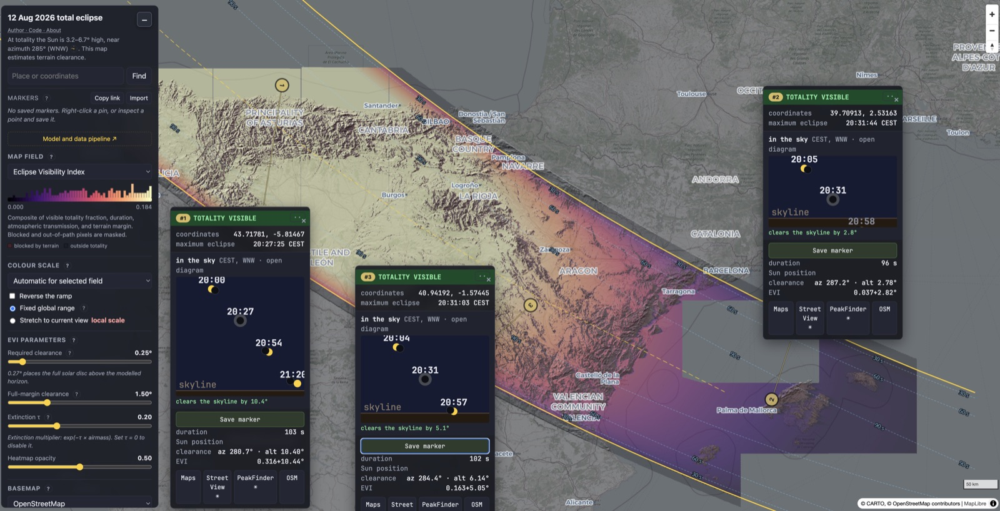

# Eclipse terrain visibility model: 12 Aug 2026, Spain

Live map: **[eclipse.chungo.es](https://eclipse.chungo.es)**



This model was designed and iterated via manual gathering of resources and thinking electric
meat, so-called human brain, currently typing this message ([JAMF](https://ja-mf.github.io)),
but the implementation was done almost entirely by LLM. The main motivation is, basically,
that modeling relatively simple geometry problems is fun, and that it's worth proving that,
as of this date, public-domain geographic data is enough to run these calculations and render
them informatively in a browser; closer to the original spirit of the internet than most of
what runs on it now. Therefore, in line with Barthes's *La mort de l'auteur*, interpretations
and psychological readings of the code belong to the infinite multiplicity of eyes beholding
this publicly. Thus, I prefer to chew glass than to care about licensing; feel free to do
whatever you want with it (see `LICENSE`). Nevertheless, happy to discuss the science and
implementation, and to do Freudian therapy on a mixture of LLMs that spitted this code over
the agentic sessions.

Numerical model estimating, for any point in mainland Spain and the Balearics, whether the
horizon of totality on 12 August 2026 will be blocked by terrain, and how that terrain
geometry interacts with contact timing and altitude to produce an effective visibility index.

`MODEL.md` is the full derivation: Besselian elements, contact-time solving, horizon ray
casting against a DEM, and the EVI (effective visibility index) combining terrain clearance,
duration, airmass extinction, and margin above the horizon. Figures are in `web_viz/diagrams/`
(TikZ sources, plus rendered SVGs for both light/dark palettes).

`web_viz/index.html` is the deployed viewer: a single self-contained page (MapLibre GL JS +
`@geomatico/maplibre-cog-protocol` from a CDN, no bundler) that reads the exported COGs
through HTTP range requests and evaluates EVI client-side. This repo has that plus the
modeling and export pipeline; it does not have the deployment tooling or the multi-GB
DEM/output rasters those scripts consume and produce — those live at the live map above.

## Pipeline

- `besselian.py` — eclipse Besselian elements and contact-time solving.
- `path.py` — path-of-totality geometry (magnitude, duration) from the Besselian elements.
- `horizon.py` — terrain ray-marching: horizon angle and limiting-occluder distance per
  azimuth, from a DEM.
- `score.py` — combines the above into EVI and fits smooth surfaces (max-eclipse time, solar
  azimuth) for cheap client-side evaluation.
- `web_viz/export_cogs.py` — the expensive step. Downloads/reuses GLO-30 DEM tiles, evaluates
  eclipse circumstances and terrain horizons per pixel, masks incomplete rays, and writes
  Cloud-Optimized GeoTIFFs (model + DEM bands) for the web client.
- `web_viz/make_band.py` — vectorizes the totality-band polygon (magnitude ≥ 1.0 + buffer)
  used to mask output outside the eclipse path.
- `web_viz/run_parcels.py` — driver that splits the totality band into longitude-strip
  parcels, exports the shared DEM once, and exports one EVI COG per parcel (resumable).
- `web_viz/cogspec.py` — shared wire-format constants (band layout, `int16` scale/nodata)
  between the Python export side and the browser decoder.
- `web_viz/export_ieec.py`, `web_viz/export_vectors.py` — auxiliary layer exports.

## Model summary

Terrain visibility, per pixel, per azimuth:

```
f_vis = clip((alt_mid + drop/2 - horizon - clearance_required) / drop, 0, 1)

EVI = f_vis
    * sqrt(duration / 120 s)
    * exp(-tau * airmass(alt_mid))
    * clip((alt_mid - horizon) / margin_width, 0, 1)
```

`alt_mid` and `drop` come from contact-time solar altitude at that point; `horizon` is the
terrain horizon angle in the direction of the eclipsed sun, from ray-marching a DEM. See
`MODEL.md` for the full derivation, including the Besselian-element setup and the horizon
ray-casting method.

## Data sources

- Eclipse geometry: Besselian elements (NASA/Espenak canon).
- Terrain: Copernicus GLO-30 DEM.

Neither is checked into this repo; `export_cogs.py` and `horizon.py` fetch/cache the DEM
tiles they need.
